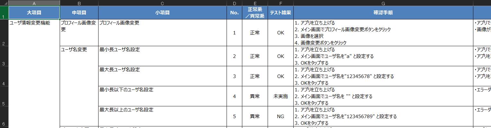

# md_test_case_to_excel

Markdownで書かれたテスト仕様書をExcel形式に変換します。Markdown+GitHubでテスト仕様書を差分管理したいヒトはご活用ください。



## Environment

本レポジトリは以下の環境でテストしています。

- Windows 11
- Python 3.11
- pandas 2.2.2
- openpyxl 3.1.5
- pydantic 2.9.1
- pyyaml 6.0.2

## Get Started

### Install dependencies

```shell
pip install -r requirements.txt
```

### Write a test specification by Markdown

サンプルファイルは`example/sample.md`にあります。

```markdown
# テスト仕様書

## 大項目
### 中項目
#### [正常|異常|準正常] [OK|NG|未実施|--] テストケース名
1. 確認手順
2. 確認手順
* [ ] 想定動作
* [ ] 想定動作
- 備考
```

### Convert markdown to xlsx

マークダウンファイルをエクセルファイルに変換します。

```bash
$ python3 converter.py -h
$ python3 converter.py -f example/sample.md --template
```

実行時に指定できるオプションとして以下があります。

|オプション名|説明|
|:---|:---|
|-h, --help| 引数のヘルプ表示|
|-f, --file| 入力ファイルパス|
|--template| テンプレートExcelファイルを使用する場合に指定|
|--test-type| テストの種別（test:テスト仕様書、ut:単体試験、it:結合試験）|
|--ut| 単体試験シートに出力する（--test-type utのショートカット）|
|--it| 結合試験シートに出力する（--test-type itのショートカット）|
|--no-auto-width| 列幅の自動調整を無効にする場合に指定|

## 使用例

### 基本的な使い方

```bash
# テンプレートを使用して新規にファイルを作成する
$ python3 converter.py -f example/sample.md --template

```

### 既存エクセルファイルの更新

既にエクセルファイルがある場合、そのファイルに追記する形で更新できます。
更新時は自動的にJ列以降のコメントや試験結果などのデータが保持されます。
例えば、最初に作成したファイルに新しいテストケースを追加する場合：

```bash
# Markdownファイルを更新後、既存のエクセルファイルに追記する
$ python3 converter.py -f example/updated_sample.md
```

### 複数シートへの書き込み

同じMarkdownファイルを異なるシートに書き込むことができます。

```bash
# 単体試験シートに書き込む
$ python3 converter.py -f example/testcases.md --ut

# 結合試験シートに同じ内容を書き込む
$ python3 converter.py -f example/testcases.md --it
```

### カスタマイズの例

列幅や自動調整などのオプションを組み合わせて使用できます。

```bash
# 列幅の自動調整を無効にする
$ python3 converter.py -f example/sample.md --no-auto-width

# 既存ファイルを更新、単体試験シートに書き込み、自動列幅調整なし
$ python3 converter.py -f example/sample.md --ut --no-auto-width
```

## シート選択機能について

単体試験シートと結合試験シートのどちらに書き込むかを選択できます。

```bash
# テスト仕様書シートに書き込む（デフォルト）
$ python3 converter.py -f example/sample.md --template

# 単体試験シートに書き込む（短いオプション名）
$ python3 converter.py -f example/sample.md --ut --template

# 結合試験シートに書き込む（短いオプション名）
$ python3 converter.py -f example/sample.md --it --template
```

## その他の設定

セル幅や列名など、その他の設定は`config.yaml`を変更してください。

```yaml
excel_settings:
  font_name: Meiryo UI
  sheet_name:
    summary: サマリー
    test: テスト仕様書
    ut: 単体試験
    it: 結合試験
```

また、マークダウンの解析パターンなども設定ファイルから変更可能です：

```yaml
columns:
  number:
    name: 'NO'
    length: 6
    horizontal: 'center'
    vertical: 'center'
  section:
    name: '大分類'
    md_pattern: '^## (.+)$'
    length: 20
    horizontal: 'left'
    vertical: 'top'
    multi-idx: true
  # ... 他の設定は省略 ...
```

## トラブルシューティング

### 既存のExcelファイルが開けない場合

エクセルファイルが他のアプリケーションで開かれていると更新できません。以下のエラーが表示される場合は、エクセルファイルを閉じてから再実行してください。

```
出力先のファイルを開いている可能性があります。エクセルファイルを閉じてください。
```

### テンプレートファイルが見つからない場合

`--template`オプションを指定した場合、デフォルトでは`assets/ARMDXP_単体・結合試験_DAS-M_テンプレート_md.xlsx`を使用します。このファイルが存在しない場合は、新規にファイルを作成します。

## Release Notes

### v0.3.0 (2025/5/29)

- 単体試験と結合試験のシート選択機能を追加
- コマンドラインオプションを拡充（--ut, --it, --test-typeなど）
- テンプレートファイル使用時の挙動を改善
- 列幅の自動調整機能を追加

### v0.2.0 (2024/9/16)

- ソースコード全体をリファクタリング
- 設定ファイルの構造を見直し
- 最新バージョンのpandas, openpyxl, pydantic, pyyamlに対応
- テストケースの未実施ステータス名を変更（"--" -> "未実施"）
- 準正常系を追加（"正常系", "異常系" -> "正常", "異常", "準正常"）

### v0.1.0 (2020/12/08)

- First Commit!

## Acknowledgements

The format of markdown borrows heavily from [ryuta46/eval-spec-maker](https://github.com/ryuta46/eval-spec-maker). The python code borrows from [torisawa/convert.py](https://gist.github.com/toriwasa/37c690862ddf67d43cfd3e1af4e40649)

## Limitations

Headers in xlsx are in Japanese only.
